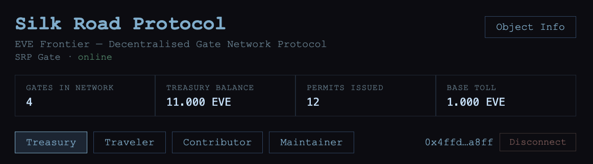
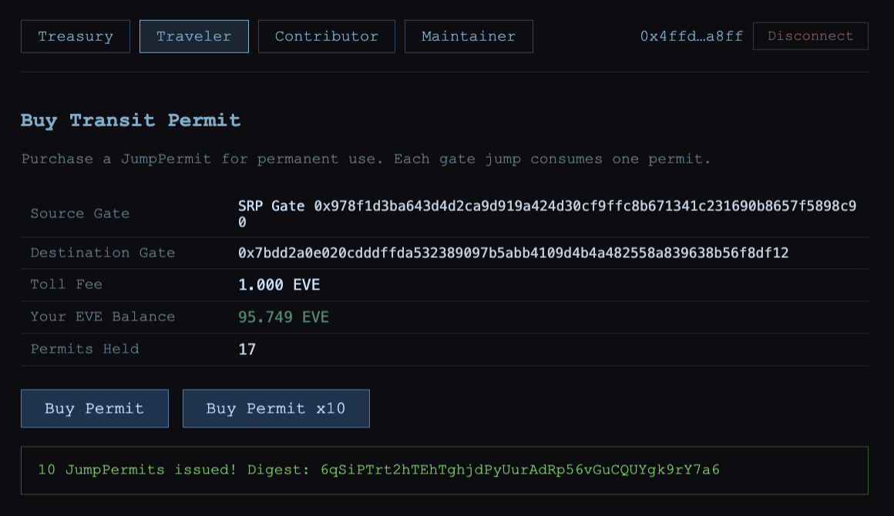
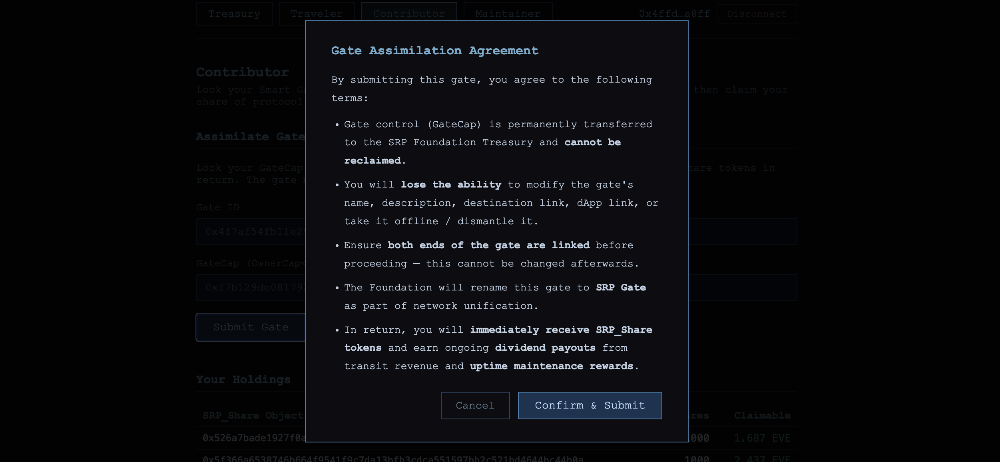
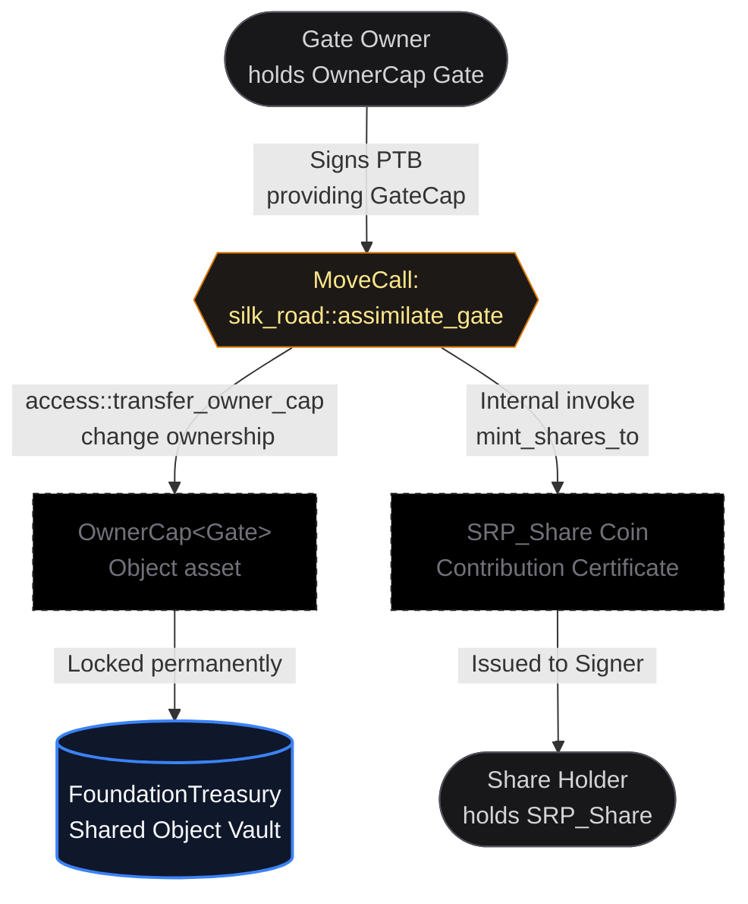
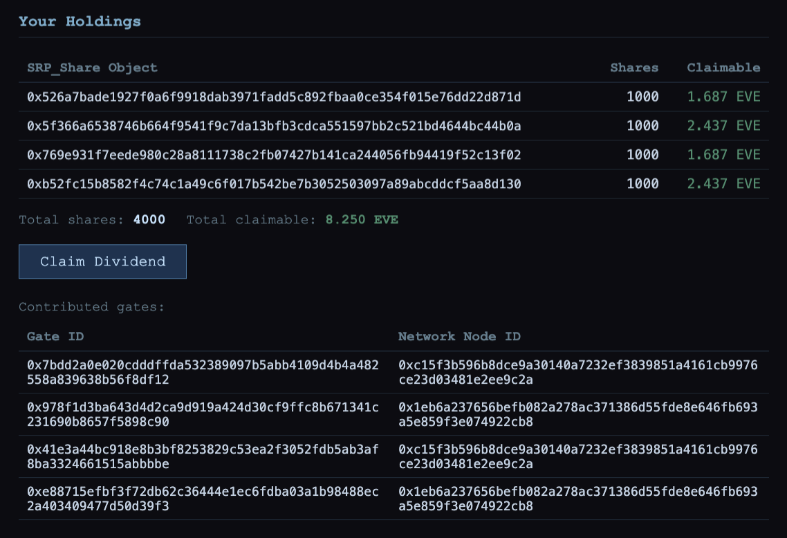
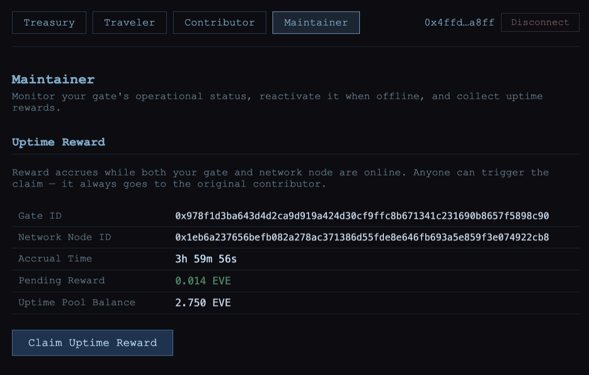
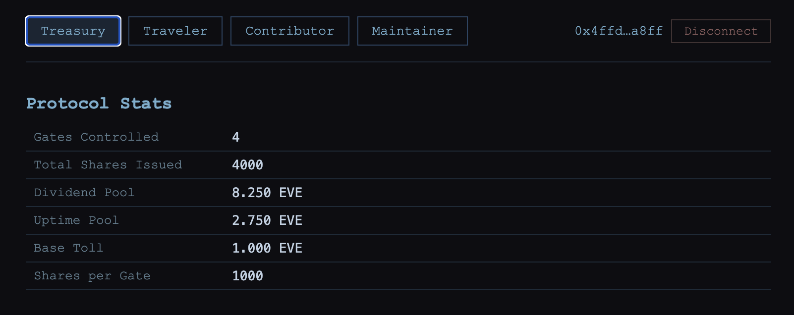
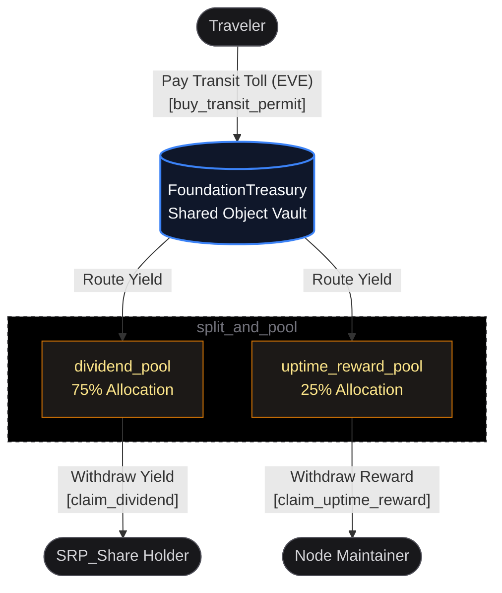

# Silk Road Protocol


Silk Road Protocol (SRP) is a decentralised gate network protocol for [EVE Frontier](https://evefrontier.com). Built for 2026 EVE Frontier Hackathon, deployed on **Sui** (testnet_utopia).



Players contribute Smart Gates to a shared `FoundationTreasury`. In return they receive
`SRP_Share` tokens and ongoing uptime rewards. All transit revenue is split between
shareholders (dividends) and the uptime reward pool.



## Gate Contributor Model



**Why GateCap is locked permanently in the treasury:**
- Prevents contributors from selling the gate (gaming share issuance).
- Prevents manual offline (disrupting the network for personal gain).
- The extension config is frozen at assimilation so `SilkRoadAuth` can never be revoked, building player trust that the toll gate cannot be quietly disabled.

**What contributors retain:**
- The `NetworkNode` OwnerCap: they continue to manage fuel through the normal game UI.
- When a node runs out of fuel the game engine automatically offlines the gate. Once refuelled, anyone (contributor or keeper bot) calls `bring_gate_online`. The uptime reward clock resets to `now`, no credit for the offline gap.

**`assimilate_gate` call sequence (single PTB):**
1. `access::transfer_owner_cap(gate_cap, treasury_addr)`
2. `silk_road::assimilate_gate(treasury, gate_obj, clock, ctx)`

The treasury address is `object::id_address(treasury)`, readable from any Sui explorer.



## Dividend Algorithm (F1 / MasterChef)



The protocol utilizes the F1 / MasterChef algorithm to achieve $O(1)$ scalability for reward distribution.

```math
\mathit{global\text{\_}reward\text{\_}per\text{\_}share} += \frac{\mathit{div\text{\_}cut} \times \mathit{PRECISION}}{\mathit{total\text{\_}shares\text{\_}issued}}
```
```math
\mathrm{claimable\_dividend} = \frac{\mathrm{shares} \times (\mathrm{global\_reward\_per\_share} - \mathrm{reward\_debt})}{\mathrm{PRECISION}}
```


- `PRECISION` = 1_000_000_000
- `reward_debt` is set at mint time so new contributors don't claim pre-existing dividends.
- `claimable_dividend` advances `reward_debt` to the current accumulator (prevents double-claim).
- `SRP_Share` transfer is disabled by default; enabled via `set_shares_transferable` without a contract upgrade (governance hook).

## Uptime Reward Model



- Reward accrues at `uptime_reward_per_ms` per millisecond while **both** the gate and its NetworkNode are online.
- Liveness is verified on-chain via `gate::is_online` and `network_node::is_network_node_online`.
- The node is cross-checked against `gate::energy_source_id`: the caller cannot pass a fake node object.
- Reward is capped at `uptime_reward_pool` balance: no revert when the pool is empty.
- Anyone may call `claim_uptime_reward`; payout always goes to the registered contributor(enabling keeper automation).

## Revenue Routing (`split_and_pool`)



```math
\mathrm{uptime\_cut} = \mathrm{toll} \times (1 − \frac{\mathrm{div\_split\_bps}}{10000})  → \mathrm{uptime\_reward\_pool}
```
```math
\mathrm{div\_cut} = \mathrm{toll} − \mathrm{uptime\_cut} → \mathrm{dividend\_pool}
```



## Post-Hackathon TODOs

1. **`proxy_refuel`**: Community fuel top-up with EVE reward, pending official support for attributed fuel deposits (`admin_acl` access + depositor field in `FuelEvent`).

2. **`reconnect_node`**: After a NetworkNode is destroyed by PvP, `energy_source_id` becomes `None` and `bring_gate_online` stops working. Needs to receive GateCap from treasury and call `gate::update_energy_source` (requires `admin_acl`). Requires game server co-sponsorship for the `admin_acl` check.

3. **`deregister_gate`**: Clean up treasury state (`gate_contributors`, `gate_last_reward_at`) when a gate is destroyed by PvP.

4. **Crowdfunded gate construction**: Multi-player material contribution.

5. **Community governance**: Replace `AdminCap` with vote weight proportional to `SRP_Share` count.

6. **Dynamic fee calculation**: Based on network utilisation.

## Key Objects

| Type | Description |
|------|-------------|
| `FoundationTreasury` | Shared object; single source of truth for all protocol state |
| `AdminCap` | Singleton; deployer only; guards all parameter mutation |
| `SRP_Share` | NFT-like certificate; `has key` only (transfer gated by `shares_transferable`) |
| `SilkRoadAuth` | Drop-only typed witness; proof-of-authority for `gate::issue_jump_permit` |

## Contract (testnet_utopia)

| | |
|---|---|
| Package | `0x5e9b4582d440403ad7a6de9ac1ffad9d155ef926d371602537cd163c27cb6f3c` |
| FoundationTreasury | `0x37dc73e19be7da77ed7c8503d4b75107249bae29da55f100571598f4b48b6166` |
| Chain | Sui testnet (`4c78adac`) |

## Repository Structure

```
contract/          Sui Move smart contract
  sources/         silk_road.move — main protocol module
  world-contracts/ Vendored EVE Frontier world package (local dependency)

dapp/              React/Vite frontend dApp
  src/             Source code
```

## Build & Run

### Contract

```bash
cd contract
sui move build
sui move test
sui client publish
```

### dApp

```bash
cd dapp
pnpm install
pnpm dev        # dev server on :5173
pnpm build      # production build
```
